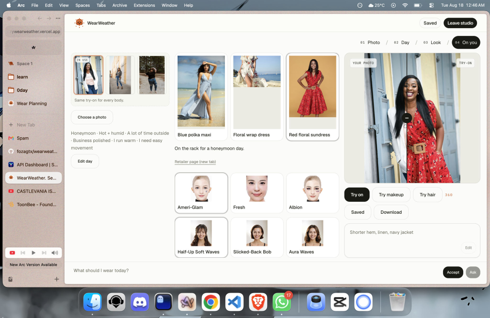

# WearWeather


**See the look. Plan the wear.**

WearWeather ranks three looks for the day you actually have, then tries one on a photo before you buy. Clothes, makeup, hair, edit, and 360 use the same path for every body, including plus size.



Live: [https://trywearweather.vercel.app](https://trywearweather.vercel.app)

## What it does

1. Describe the day, or ask the stylist.
2. Pick up to three priorities: I run warm, I need easy movement, I prefer coverage.
3. Get three Wear Plans with reasons and a check-before-buying note.
4. Try one look on an example photo or your own.
5. Optionally add makeup or hair on that same photo.

The picture is a rehearsal. It does not guarantee fit, fabric feel, or sizing. WearWeather does not guess gender and does not score your body.

## Run it

```bash
pnpm install
pnpm dev
```

Open [http://localhost:3000](http://localhost:3000). Ranking works without keys. Live try-on needs `YOUCAM_API_KEY`. The stylist and clothes edit need `AIMLAPI_KEY`.

## Configuration

| Variable | Used for |
| --- | --- |
| `YOUCAM_API_KEY` | Clothes, makeup, and hair try-on |
| `AIMLAPI_KEY` | Stylist and clothes edit |
| `AIMLAPI_MODEL` | Optional. Default `deepseek/deepseek-v4-flash` |
| `AIMLAPI_EDIT_MODEL` | Optional. Default `flux/kontext-pro/image-to-image` |

## Notes

- Photo: one person, facing forward, face and shoulders visible. JPG or PNG, under 10 MB.
- No account. The photo stays in the browser until you start try-on.
- Example photos include a Black woman, a mid-size woman, and a plus-size woman.
